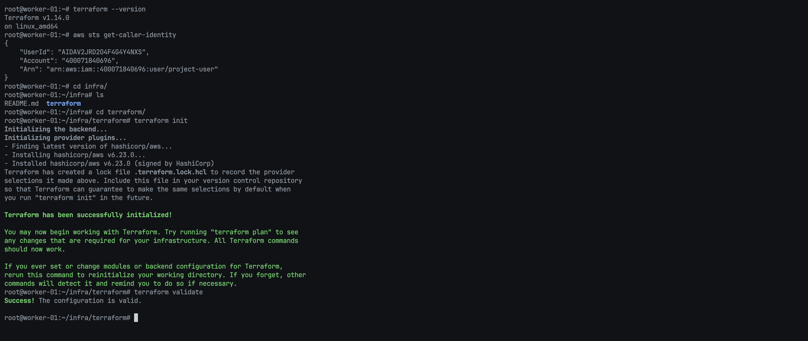
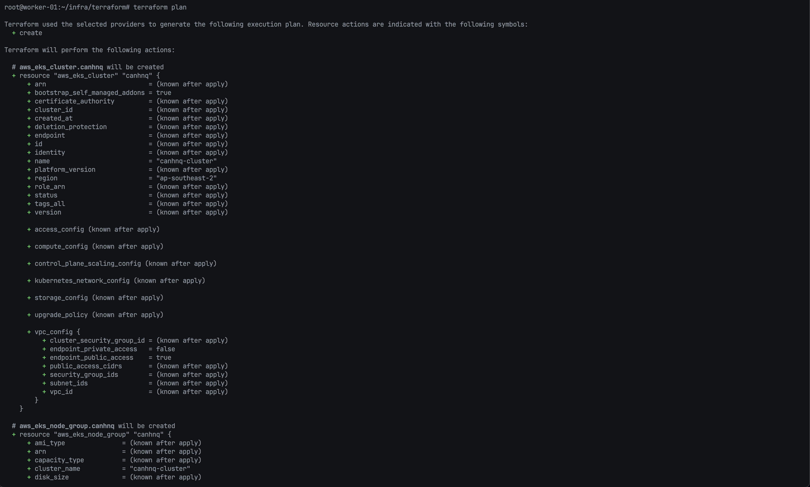
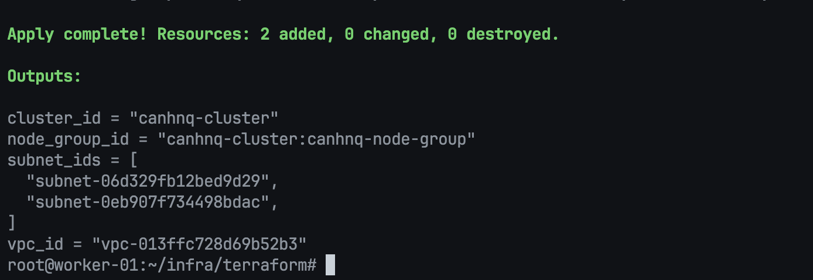
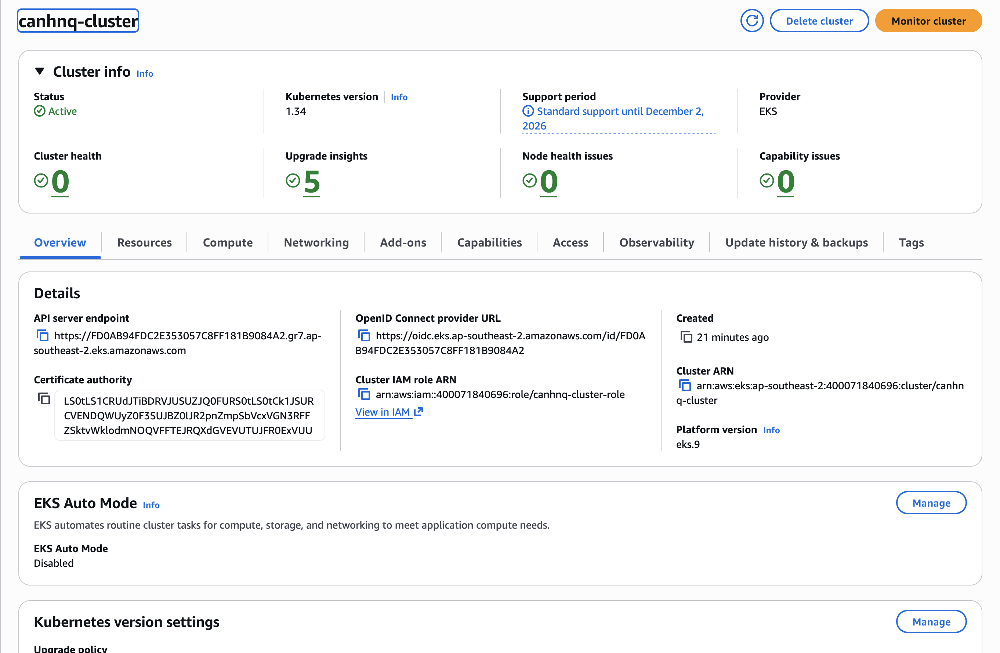
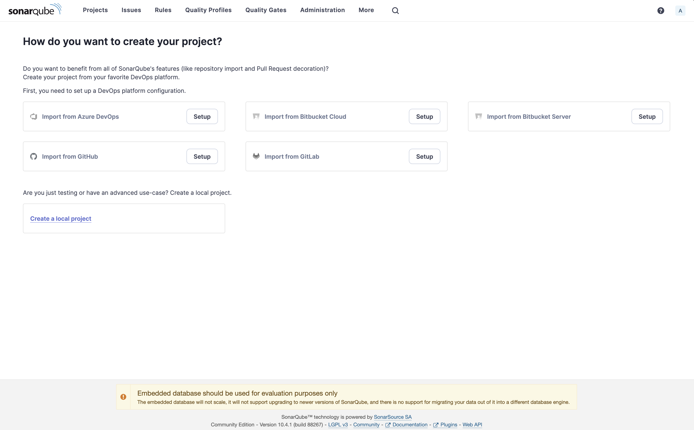
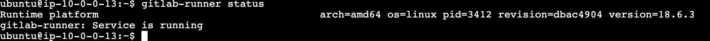
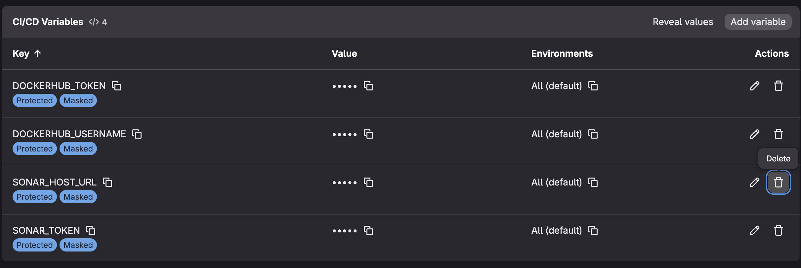
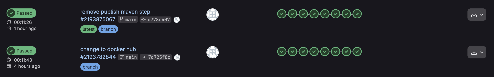

# Dự Án DevOps: Triển Khai End-to-End Ứng Dụng FullStack Blogging

### (Ứng dụng Spring Boot được triển khai trên AWS với EKS, Terraform, GitLab CI, SonarQube, Trivy & Rancher)

## **Tổng Quan Dự Án**

Một **[Ứng dụng Blogging)** được xây dựng với Java (Spring Boot), Docker và Kubernetes — được tự động hóa hoàn toàn sử dụng các công cụ DevOps hiện đại. Ứng dụng này hỗ trợ đăng bài, chỉnh sửa và quản lý blog với tích hợp continuous delivery và bảo mật.

## **Tính Năng**

- Tạo, Chỉnh sửa và Xóa Bài viết Blog

- RESTful API sử dụng Spring Boot (Java)

- Phân tích mã nguồn tĩnh với SonarQube

- Quét lỗ hổng bảo mật với Trivy

- Pipeline tự động Build, Test và Deploy

- Triển khai Kubernetes trên AWS EKS

- Container hóa sử dụng Docker

- CI/CD với GitLab CI

- Thông báo Email khi Triển khai qua GitLab

## **DevOps & Triển Khai**

- Docker

- Kubernetes

- AWS EKS (Elastic Kubernetes Service)

- Terraform (Infrastructure as Code)

- GitLab CI (CI/CD pipeline)

- SonarQube (Kiểm tra Chất lượng Mã nguồn)

- Trivy (Quét Container Image)

- Thông báo Email GitLab

- Rancher (Quản lý Kubernetes Cluster)

## **Hạ Tầng & Cài Đặt (AWS EC2 + K8s + Công cụ DevOps)**

### **1. Thiết Lập AWS**

1. VPC mặc định

2. **Security Group:** SG mặc định với tất cả các port cần thiết được mở

3. Tạo 4 Instances (t2.medium, 25gb)

- Master Node

- Slave-1

- Slave-2

- SonarQube

- GitLab Runner (t2.medium hoặc sử dụng runner hiện có)

## **Thiết Lập AWS EKS Cluster bằng Terraform**

### **1. Cài Đặt AWS CLI**

Tải và cài đặt AWS CLI để kết nối với AWS cloud

```bash
curl "https://awscli.amazonaws.com/awscli-exe-linux-x86_64.zip" -o "awscliv2.zip"
unzip awscliv2.zip
sudo ./aws/install
aws --version
```

**Kết quả mong đợi:**

```plaintext
aws-cli/2.x.x Python/3.x.x Linux/...
```

### **2. Cấu Hình AWS CLI**

Bạn cần thông tin xác thực AWS để sử dụng CLI. Chạy lệnh:

```bash
aws configure
```

Cung cấp các thông tin sau khi được yêu cầu:

- AWS Access Key ID

- AWS Secret Access Key

- Region mặc định (ví dụ: `ap-southeast-1`)

- Định dạng output (`json` được khuyến nghị)

### **3. Cài Đặt Terraform trên Ubuntu**

**Phương pháp 1: Kho APT Chính thức (Khuyến nghị cho Production)**

```bash
# Cài đặt các gói cần thiết
sudo apt install -y gnupg software-properties-common curl
# Thêm khóa GPG của HashiCorp
curl -fsSL https://apt.releases.hashicorp.com/gpg | sudo gpg --dearmor -o /usr/share/keyrings/hashicorp-archive-keyring.gpg
# Thêm kho HashiCorp Linux chính thức
echo "deb [signed-by=/usr/share/keyrings/hashicorp-archive-keyring.gpg] https://apt.releases.hashicorp.com $(lsb_release -cs) main" | \
sudo tee /etc/apt/sources.list.d/hashicorp.list
# Cập nhật và cài đặt Terraform
sudo apt update
sudo apt install terraform -y
# Xác minh cài đặt
terraform -version
```

**Phương pháp 2: Snap (Cài đặt nhanh, không phải luôn là phiên bản mới nhất)**

```bash
sudo snap install terraform --classic
```

### **4. Tạo EKS Cluster bằng Terraform**

**Tạo thư mục Terraform**

```bash
mkdir terra
cd terra
```

**Tạo File Terraform**

1. Tạo file Main

```bash
vim main.tf
```

Sao chép file cấu hình

```hcl
provider "aws" {
  region = "ap-southeast-1"
}
resource "aws_vpc" "abrahimcse_vpc" {
  cidr_block = "10.0.0.0/16"
  tags = {
    Name = "abrahimcse-vpc"
  }
}
resource "aws_subnet" "abrahimcse_subnet" {
  count = 2
  vpc_id                  = aws_vpc.abrahimcse_vpc.id
  cidr_block              = cidrsubnet(aws_vpc.abrahimcse_vpc.cidr_block, 8, count.index)
  availability_zone       = element(["ap-southeast-1a", "ap-southeast-1b"], count.index)
  map_public_ip_on_launch = true
  tags = {
    Name = "abrahimcse-subnet-${count.index}"
  }
}
resource "aws_internet_gateway" "abrahimcse_igw" {
  vpc_id = aws_vpc.abrahimcse_vpc.id
  tags = {
    Name = "abrahimcse-igw"
  }
}
resource "aws_route_table" "abrahimcse_route_table" {
  vpc_id = aws_vpc.abrahimcse_vpc.id
  route {
    cidr_block = "0.0.0.0/0"
    gateway_id = aws_internet_gateway.abrahimcse_igw.id
  }
  tags = {
    Name = "abrahimcse-route-table"
  }
}
resource "aws_route_table_association" "a" {
  count          = 2
  subnet_id      = aws_subnet.abrahimcse_subnet[count.index].id
  route_table_id = aws_route_table.abrahimcse_route_table.id
}
resource "aws_security_group" "abrahimcse_cluster_sg" {
  vpc_id = aws_vpc.abrahimcse_vpc.id
  egress {
    from_port   = 0
    to_port     = 0
    protocol    = "-1"
    cidr_blocks = ["0.0.0.0/0"]
  }
  tags = {
    Name = "abrahimcse-cluster-sg"
  }
}
resource "aws_security_group" "abrahimcse_node_sg" {
  vpc_id = aws_vpc.abrahimcse_vpc.id
  ingress {
    from_port   = 0
    to_port     = 0
    protocol    = "-1"
    cidr_blocks = ["0.0.0.0/0"]
  }
  egress {
    from_port   = 0
    to_port     = 0
    protocol    = "-1"
    cidr_blocks = ["0.0.0.0/0"]
  }
  tags = {
    Name = "abrahimcse-node-sg"
  }
}
resource "aws_eks_cluster" "abrahimcse" {
  name     = "abrahimcse-cluster"
  role_arn = aws_iam_role.abrahimcse_cluster_role.arn
  vpc_config {
    subnet_ids         = aws_subnet.abrahimcse_subnet[*].id
    security_group_ids = [aws_security_group.abrahimcse_cluster_sg.id]
  }
}
resource "aws_eks_node_group" "abrahimcse" {
  cluster_name    = aws_eks_cluster.abrahimcse.name
  node_group_name = "abrahimcse-node-group"
  node_role_arn   = aws_iam_role.abrahimcse_node_group_role.arn
  subnet_ids      = aws_subnet.abrahimcse_subnet[*].id
  scaling_config {
    desired_size = 2
    max_size     = 2
    min_size     = 2
  }
  instance_types = ["t2.large"]
  remote_access {
    ec2_ssh_key = var.ssh_key_name
    source_security_group_ids = [aws_security_group.abrahimcse_node_sg.id]
  }
}
resource "aws_iam_role" "abrahimcse_cluster_role" {
  name = "abrahimcse-cluster-role"
  assume_role_policy = <<EOF
{
  "Version": "2012-10-17",
  "Statement": [
    {
      "Effect": "Allow",
      "Principal": {
        "Service": "eks.amazonaws.com"
      },
      "Action": "sts:AssumeRole"
    }
  ]
}
EOF
}
resource "aws_iam_role_policy_attachment" "abrahimcse_cluster_role_policy" {
  role       = aws_iam_role.abrahimcse_cluster_role.name
  policy_arn = "arn:aws:iam::aws:policy/AmazonEKSClusterPolicy"
}
resource "aws_iam_role" "abrahimcse_node_group_role" {
  name = "abrahimcse-node-group-role"
  assume_role_policy = <<EOF
{
  "Version": "2012-10-17",
  "Statement": [
    {
      "Effect": "Allow",
      "Principal": {
        "Service": "ec2.amazonaws.com"
      },
      "Action": "sts:AssumeRole"
    }
  ]
}
EOF
}
resource "aws_iam_role_policy_attachment" "abrahimcse_node_group_role_policy" {
  role       = aws_iam_role.abrahimcse_node_group_role.name
  policy_arn = "arn:aws:iam::aws:policy/AmazonEKSWorkerNodePolicy"
}
resource "aws_iam_role_policy_attachment" "abrahimcse_node_group_cni_policy" {
  role       = aws_iam_role.abrahimcse_node_group_role.name
  policy_arn = "arn:aws:iam::aws:policy/AmazonEKS_CNI_Policy"
}
resource "aws_iam_role_policy_attachment" "abrahimcse_node_group_registry_policy" {
  role       = aws_iam_role.abrahimcse_node_group_role.name
  policy_arn = "arn:aws:iam::aws:policy/AmazonEC2ContainerRegistryReadOnly"
}
```

2. Tạo file Variable

```bash
vim variable.tf
```

Sao chép và dán

```hcl
variable "ssh_key_name" {
  description = "Tên của cặp khóa SSH để sử dụng cho các instance"
  type        = string
  default     = "hsms-stg-common"
}
```

3. Tạo file Output

```bash
vim output.tf
```

Sao chép và dán

```hcl
output "cluster_id" {
  value = aws_eks_cluster.abrahimcse.id
}
output "node_group_id" {
  value = aws_eks_node_group.abrahimcse.id
}
output "vpc_id" {
  value = aws_vpc.abrahimcse_vpc.id
}
output "subnet_ids" {
  value = aws_subnet.abrahimcse_subnet[*].id
}
```

4. Chạy file Terraform để tạo EKS

```bash
terraform init
terraform plan
terraform validate
terraform apply --auto-approve
```



**Khởi tạo thành công**



**Terraform Plan**



**Tạo EKS thành công**

5. Kết nối với EKS Cluster

```bash
aws eks --region ap-southeast-1 update-kubeconfig --name abrahimcse-cluster
```

6. Cài đặt kubectl và kiểm tra nodes

```bash
sudo snap install kubectl --classic
kubectl get nodes
```


**AWS EKS Cluster**



**AWS EC2 Dashboard**

## **Chuẩn Bị Các Server Khác**

## **1. Thiết Lập Server SonarQube & Trivy (Cài đặt Native trên Ubuntu)**

> EC2 instance này sẽ chạy cả SonarQube (chất lượng mã) và Trivy (quét lỗ hổng).

### **Bước 1: Cài Đặt Docker**

```bash
sudo apt update && sudo apt upgrade -y

# Cài đặt Docker
curl -fsSL https://get.docker.com -o get-docker.sh
sudo sh get-docker.sh
sudo usermod -aG docker $USER
```

### **Bước 2: Chạy SonarQube bằng Docker**

```bash
docker run -d --name sonarqube \
  -p 9000:9000 \
  -v sonarqube_data:/opt/sonarqube/data \
  -v sonarqube_logs:/opt/sonarqube/logs \
  -v sonarqube_extensions:/opt/sonarqube/extensions \
  sonarqube:lts-community
```

Kiểm tra container đang chạy:

```bash
docker ps
docker logs -f sonarqube
```

- Truy cập SonarQube: `http://<server_ip>:9000/`

- Thông tin đăng nhập mặc định:

- **Username:** `admin`

- **Password:** `admin` (bạn sẽ được yêu cầu đổi mật khẩu khi đăng nhập lần đầu)



**Tổng quan Chất lượng Mã nguồn**

### **Bước 3: Tạo Token Xác Thực**

1. Truy cập: `**Administration > Security > Users > Tokens**`

2. Tạo token mới:

- **Name:** `sonar-token`

3\. Click **Generate** và **sao chép token**

`sonar-token`

> Lưu token này - nó sẽ được sử dụng làm `SONAR_TOKEN` trong GitLab CI/CD Variables

---

### **Cài Đặt Trivy (Trình Quét Lỗ Hổng)**

Trivy là trình quét bảo mật toàn diện cho containers, filesystems và mã nguồn. Cài đặt nó trên cùng EC2 instance với SonarQube.

### **Bước 1: Thêm Kho APT Trivy**

```bash
# Cài đặt các gói cần thiết
sudo apt-get install wget gnupg -y

# Thêm khóa GPG Trivy
wget -qO - https://aquasecurity.github.io/trivy-repo/deb/public.key | gpg --dearmor | sudo tee /usr/share/keyrings/trivy.gpg > /dev/null

# Thêm kho Trivy
echo "deb [signed-by=/usr/share/keyrings/trivy.gpg] https://aquasecurity.github.io/trivy-repo/deb generic main" | sudo tee -a /etc/apt/sources.list.d/trivy.list
```

### **Bước 2: Cài Đặt Trivy**

```bash
sudo apt-get update
sudo apt-get install trivy -y

# Xác minh cài đặt
trivy --version
```

### **Bước 3: Kiểm Tra Trivy**

```bash
# Quét filesystem
trivy fs --severity HIGH,CRITICAL /path/to/your/project

# Quét Docker image
trivy image nginx:latest
```

### **Bước 4: (Tùy chọn) Chạy Trivy như Server**

Để quét nhanh hơn trong CI/CD pipelines, bạn có thể chạy Trivy ở chế độ server:

```bash
# Tạo systemd service cho Trivy server
sudo vim /etc/systemd/system/trivy-server.service
```

Thêm nội dung sau:

```ini
[Unit]
Description=Trivy Server
After=network.target

[Service]
Type=simple
ExecStart=/usr/bin/trivy server --listen 0.0.0.0:8085
Restart=always
User=root

[Install]
WantedBy=multi-user.target
```

Khởi động service:

```bash
sudo systemctl daemon-reload
sudo systemctl start trivy-server
sudo systemctl enable trivy-server

# Kiểm tra trạng thái
sudo systemctl status trivy-server
```

**Truy cập Trivy Server:** `http://<server_ip>:8085`

> **Lưu ý:** Mở port 8085 trong EC2 security group nếu chạy Trivy ở chế độ server.

Để sử dụng Trivy server từ GitLab CI pipeline, bạn có thể cấu hình biến môi trường `TRIVY_SERVER`:

```yaml
trivy-scan:
  stage: security-scan
  script:
    - trivy client --remote http://<TRIVY_SERVER_IP>:8085 fs .
```

---

### **Bước 5: Cấu Hình Webhook cho GitLab (Tùy chọn)**

Nếu bạn muốn SonarQube gửi kết quả quality gate về GitLab:

1. Truy cập: `**Administration > Configuration > Webhooks**`

2. Click Create Webhook

- **Name:** `gitlab`

- **URL:** `https://gitlab.com/api/v4/projects/<PROJECT_ID>/webhooks`

> Lưu ý: Đối với GitLab self-hosted, điều chỉnh URL phù hợp.

## **2. Thiết Lập GitLab Runner**

Dự án này sử dụng **hai GitLab Runners** với các executor khác nhau:

| Runner            | Executor   | Cài đặt       | Mục đích                               |
| ----------------- | ---------- | ------------- | -------------------------------------- |
| Shell Runner      | Shell      | EC2 Instance  | Docker builds, SonarQube, Maven, Trivy |
| Kubernetes Runner | Kubernetes | Helm trên EKS | Deploy ứng dụng lên EKS cluster        |

---

### **2.1. Shell Executor Runner (Cài đặt trên EC2)**

Runner này được cài đặt trực tiếp trên EC2 instance để xử lý Docker builds, phân tích SonarQube, Maven builds và quét Trivy.

#### **Bước 1: Yêu Cầu Hệ Thống**

```bash
sudo apt update && sudo apt upgrade -y

# Cài đặt Docker
curl -fsSL https://get.docker.com -o get-docker.sh
sudo sh get-docker.sh
sudo usermod -aG docker $USER
sudo usermod -aG docker gitlab-runner

# Cài đặt Maven & Java
sudo apt install openjdk-17-jdk maven -y

# Xác minh cài đặt
java -version
mvn -version
docker --version
```

#### **Bước 2: Cài Đặt Trivy (Trình Quét Lỗ Hổng)**

```bash
# Cài đặt các gói cần thiết
sudo apt-get install wget gnupg -y

# Thêm khóa GPG Trivy
wget -qO - https://aquasecurity.github.io/trivy-repo/deb/public.key | gpg --dearmor | sudo tee /usr/share/keyrings/trivy.gpg > /dev/null

# Thêm kho Trivy
echo "deb [signed-by=/usr/share/keyrings/trivy.gpg] https://aquasecurity.github.io/trivy-repo/deb generic main" | sudo tee -a /etc/apt/sources.list.d/trivy.list

# Cài đặt Trivy
sudo apt-get update
sudo apt-get install trivy -y

# Xác minh cài đặt
trivy --version
```

#### **Bước 3: Cài Đặt GitLab Runner**

```bash
# Thêm kho chính thức của GitLab
curl -L "https://packages.gitlab.com/install/repositories/runner/gitlab-runner/script.deb.sh" | sudo bash

# Cài đặt GitLab Runner
sudo apt-get install gitlab-runner -y

# Xác minh cài đặt
gitlab-runner --version
```

#### **Bước 4: Đăng Ký Shell Executor Runner**

```bash
sudo gitlab-runner register
```

Khi được hỏi, nhập:

- **GitLab instance URL:** `https://gitlab.com/` (hoặc URL self-hosted của bạn)
- **Registration token:** Lấy từ GitLab project > Settings > CI/CD > Runners
- **Description:** `shell-runner`
- **Tags:** `shell,docker,maven,sonar,trivy`
- **Executor:** `shell`

#### **Bước 5: Cấu Hình Runner**

Chỉnh sửa cấu hình runner:

```bash
sudo vim /etc/gitlab-runner/config.toml
```

Ví dụ cấu hình:

```toml
concurrent = 2
check_interval = 0

[[runners]]
  name = "shell-runner"
  url = "https://gitlab.com/"
  token = "YOUR_SHELL_RUNNER_TOKEN"
  executor = "shell"
  [runners.custom_build_dir]
  [runners.cache]
    [runners.cache.s3]
    [runners.cache.gcs]
    [runners.cache.azure]
```

#### **Bước 6: Khởi Động và Kích Hoạt Runner**

```bash
sudo gitlab-runner start
sudo systemctl enable gitlab-runner

# Xác minh runner đã được đăng ký
sudo gitlab-runner list
```


**GitLab Runner đã được đăng ký**



**Kiểm tra trạng thái GitLab Runner**

---

### **2.2. Kubernetes Executor Runner (Cài đặt bằng Helm trên EKS)**

Runner này được cài đặt trên EKS cluster bằng Helm chart, sử dụng để deploy ứng dụng lên Kubernetes.

#### **Bước 1: Tạo ClusterRole cho GitLab Runner**

Tạo file `clusterrole.yaml` để cấp quyền cho runner deploy across namespaces:

```yaml
# ClusterRole for GitLab Runner to deploy across namespaces
apiVersion: rbac.authorization.k8s.io/v1
kind: ClusterRole
metadata:
  name: gitlab-runner-deploy
rules:
  # Namespace permissions
  - apiGroups: [""]
    resources:
      - namespaces
    verbs: ["get", "list", "watch", "create", "update", "patch"]

  # Core resources
  - apiGroups: [""]
    resources:
      - pods
      - pods/exec
      - pods/attach
      - pods/log
      - services
      - endpoints
      - configmaps
      - secrets
      - serviceaccounts
      - persistentvolumeclaims
      - events
    verbs: ["get", "list", "watch", "create", "update", "patch", "delete"]

  # Deployments and workloads
  - apiGroups: ["apps"]
    resources:
      - deployments
      - replicasets
      - statefulsets
      - daemonsets
    verbs: ["get", "list", "watch", "create", "update", "patch", "delete"]

  # Jobs
  - apiGroups: ["batch"]
    resources:
      - jobs
      - cronjobs
    verbs: ["get", "list", "watch", "create", "update", "patch", "delete"]

  # Networking
  - apiGroups: ["networking.k8s.io"]
    resources:
      - ingresses
    verbs: ["get", "list", "watch", "create", "update", "patch", "delete"]

---
# Bind ClusterRole to the gitlab-runner service account
apiVersion: rbac.authorization.k8s.io/v1
kind: ClusterRoleBinding
metadata:
  name: gitlab-runner-deploy-binding
roleRef:
  apiGroup: rbac.authorization.k8s.io
  kind: ClusterRole
  name: gitlab-runner-deploy
subjects:
  - kind: ServiceAccount
    name: gitlab-runner
    namespace: gitlab-runner
```

Apply ClusterRole:

```bash
kubectl apply -f clusterrole.yaml
```

#### **Bước 2: Tạo Helm Values File**

Tạo file `values.yaml` cho GitLab Runner:

```yaml
# GitLab URL
gitlabUrl: https://gitlab.com/

# Runner registration token (get from GitLab → Settings → CI/CD → Runners)
runnerToken: ""

# Runner configuration
runners:
  name: "eks-runner"
  tags: "kubernetes,eks"
  runUntagged: false
  protected: false

  config: |
    [[runners]]
      [runners.kubernetes]
        namespace = "gitlab-runner"
        image = "ubuntu:22.04"
        privileged = false
        
        cpu_limit = "1"
        memory_limit = "1Gi"
        cpu_request = "500m"
        memory_request = "512Mi"
        
        service_account = "gitlab-runner"
        pull_policy = ["if-not-present"]

# RBAC
rbac:
  create: true
  clusterWideAccess: true

# Service account
serviceAccount:
  create: true
  name: "gitlab-runner"

# Runner pod resources
resources:
  limits:
    memory: 256Mi
    cpu: 500m
  requests:
    memory: 128Mi
    cpu: 100m

# Concurrent jobs
concurrent: 4
checkInterval: 10
```

#### **Bước 3: Cài Đặt GitLab Runner bằng Helm**

```bash
# Thêm GitLab Helm repository
helm repo add gitlab https://charts.gitlab.io
helm repo update

# Tạo namespace cho runner
kubectl create namespace gitlab-runner

# Cài đặt GitLab Runner
helm install gitlab-runner gitlab/gitlab-runner \
  --namespace gitlab-runner \
  -f values.yaml \
  --set runnerToken="YOUR_RUNNER_TOKEN"
```

#### **Bước 4: Xác Minh Cài Đặt**

```bash
# Kiểm tra pods
kubectl get pods -n gitlab-runner

# Kiểm tra logs
kubectl logs -n gitlab-runner -l app=gitlab-runner
```

Runner sẽ tự động đăng ký với GitLab và sẵn sàng nhận jobs với tags `kubernetes,eks`.

## **Cấu Hình GitLab CI/CD**

### **Bước 1: Cấu Hình CI/CD Variables**

Truy cập: `**Your Project > Settings > CI/CD > Variables**`

Thêm các biến sau (đặt "Masked" cho secrets):

| Biến                | Loại              | Mô tả                                                     |
| ------------------- | ----------------- | --------------------------------------------------------- |
| `SONAR_HOST_URL`    | Variable          | URL server SonarQube (ví dụ: `http://54.169.71.209:9000`) |
| `SONAR_TOKEN`       | Variable (Masked) | Token xác thực SonarQube                                  |
| `DOCKERHUB_USERNAME`| Variable          | Username Docker Hub                                       |
| `DOCKERHUB_TOKEN`   | Variable (Masked) | Access token Docker Hub                                   |



**GitLab CI/CD Variables**

### **Bước 2: Cấu Hình Pipeline**

File `.gitlab-ci.yml` trong repository định nghĩa pipeline với các stages sau:

1. **compile** - Biên dịch mã nguồn Java
2. **test** - Chạy unit tests với JUnit
3. **security-scan** - Quét lỗ hổng filesystem với Trivy
4. **code-quality** - Phân tích mã tĩnh với SonarQube
5. **build** - Đóng gói JAR artifact và build Docker image
6. **deploy** - Triển khai lên Kubernetes EKS
7. **verify** - Xác minh trạng thái triển khai



**Các Stages Pipeline**

### **Bước 3: Kích Hoạt Pipeline**

Pipeline chạy tự động khi:

- Push lên nhánh `main` hoặc `master`
- Merge requests

Bạn cũng có thể kích hoạt thủ công từ: `**CI/CD > Pipelines > Run Pipeline**`

## **Thiết Lập Thông Báo Email GitLab**

GitLab cung cấp thông báo email tích hợp cho các sự kiện pipeline.

### **Cho GitLab.com:**

1. Truy cập: `**User Settings > Notifications**`
2. Đặt mức thông báo thành "Watch" cho project của bạn
3. Bật thông báo pipeline

### **Cho GitLab Self-Hosted:**

Cấu hình SMTP trong `/etc/gitlab/gitlab.rb`:

```ruby
gitlab_rails['smtp_enable'] = true
gitlab_rails['smtp_address'] = "smtp.gmail.com"
gitlab_rails['smtp_port'] = 587
gitlab_rails['smtp_user_name'] = "your-email@gmail.com"
gitlab_rails['smtp_password'] = "your-app-password"
gitlab_rails['smtp_domain'] = "smtp.gmail.com"
gitlab_rails['smtp_authentication'] = "login"
gitlab_rails['smtp_enable_starttls_auto'] = true
gitlab_rails['gitlab_email_from'] = 'gitlab@yourdomain.com'
```

Sau đó cấu hình lại:

```bash
sudo gitlab-ctl reconfigure
```

### **Thông Báo Tùy Chỉnh (Tùy chọn)**

Thêm job thông báo trong `.gitlab-ci.yml`:

```yaml
notify-success:
  stage: .post
  script:
    - |
      curl -X POST "https://api.telegram.org/bot$TELEGRAM_BOT_TOKEN/sendMessage" \
        -d "chat_id=$TELEGRAM_CHAT_ID" \
        -d "text=Pipeline $CI_PIPELINE_ID thành công cho $CI_PROJECT_NAME"
  when: on_success
  only:
    - main
```

## **Thiết Lập Quản Lý Cluster: Rancher trên EKS**

Rancher là nền tảng quản lý Kubernetes giúp đơn giản hóa việc triển khai và quản lý nhiều cluster. Chúng ta sẽ cài đặt Rancher trực tiếp trên EKS cluster.

### **Bước 1: Cài Đặt Helm (nếu chưa có)**

```bash
curl https://raw.githubusercontent.com/helm/helm/main/scripts/get-helm-3 | bash
helm version
```

### **Bước 2: Thêm Helm Repositories**

```bash
# Thêm Rancher Helm repository
helm repo add rancher-stable https://releases.rancher.com/server-charts/stable

# Thêm Jetstack repository (cho cert-manager)
helm repo add jetstack https://charts.jetstack.io

# Thêm ingress-nginx repository
helm repo add ingress-nginx https://kubernetes.github.io/ingress-nginx

# Cập nhật repositories
helm repo update
```

### **Bước 3: Cài Đặt Ingress Controller**

```bash
helm install ingress-nginx ingress-nginx/ingress-nginx \
  --namespace ingress-nginx \
  --create-namespace \
  --set controller.service.type=LoadBalancer
```

### **Bước 4: Cài Đặt cert-manager**

```bash
# Cài đặt CRDs của cert-manager
kubectl apply -f https://github.com/cert-manager/cert-manager/releases/download/v1.14.4/cert-manager.crds.yaml

# Cài đặt cert-manager
helm install cert-manager jetstack/cert-manager \
  --namespace cert-manager \
  --create-namespace \
  --version v1.14.4
```

### **Bước 5: Cài Đặt Rancher**

```bash
# Tạo namespace cho Rancher
kubectl create namespace cattle-system

# Cài đặt Rancher với Rancher-generated certificates
helm install rancher rancher-stable/rancher \
  --namespace cattle-system \
  --set hostname=rancher.local \
  --set replicas=1 \
  --set bootstrapPassword=admin123
```

### **Bước 6: Truy Cập Rancher UI**

Lấy URL LoadBalancer:

```bash
# Lấy địa chỉ LoadBalancer
kubectl get svc -n ingress-nginx ingress-nginx-controller -o jsonpath='{.status.loadBalancer.ingress[0].hostname}'
```

Hoặc sử dụng port-forward để truy cập local:

```bash
kubectl -n cattle-system port-forward svc/rancher 8443:443
```

Truy cập: `https://localhost:8443` hoặc `https://<LOADBALANCER_URL>`

**Thông tin đăng nhập:**

- **Username:** `admin`
- **Password:** `admin123` (hoặc lấy từ secret)

Lấy password từ secret (nếu cần):

```bash
kubectl get secret --namespace cattle-system bootstrap-secret -o go-template='{{.data.bootstrapPassword|base64decode}}{{"\n"}}'
```

### **Kết Luận**

Dự án này không chỉ là một ứng dụng CRUD **FullStack Blogging** đơn giản — nó là một **hành trình DevOps CI/CD hoàn chỉnh** được đóng gói với các công cụ thực sự được sử dụng trong production. Được hỗ trợ bởi **GitLab CI/CD** thay vì Jenkins, nó cung cấp trải nghiệm tích hợp và tinh giản hơn với hỗ trợ container registry tích hợp, tích hợp Kubernetes native và cấu hình pipeline đơn giản hóa.
